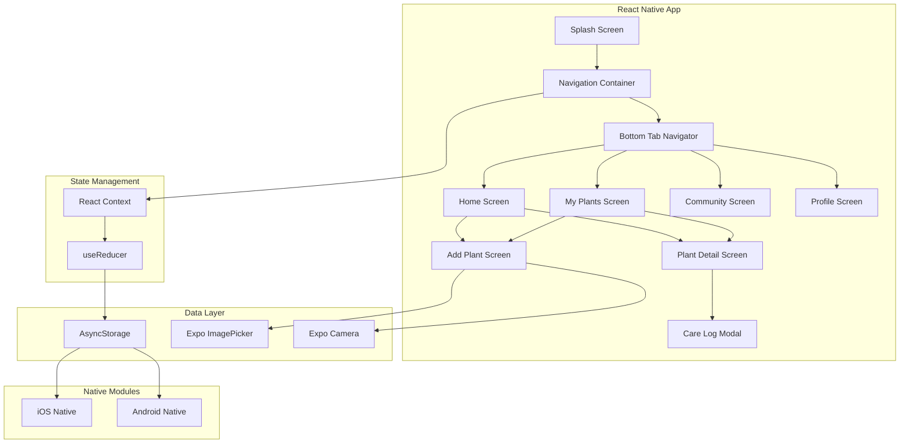

# Design Document - Planta App

## Overview

O Planta App é um aplicativo mobile nativo multiplataforma construído com React Native, permitindo execução nativa em iOS e Android. O app utiliza React Navigation para navegação por abas, AsyncStorage para persistência de dados, Expo para acesso a APIs nativas (câmera, galeria), e um design system baseado em cores botânicas que transmitem calma e conexão com a natureza.

## Architecture

### Arquitetura Geral



### Estrutura de Arquivos

```
planta-app/
├── App.js                      # Entry point
├── app.json                    # Expo config
├── package.json
├── babel.config.js
├── metro.config.js
├── src/
│   ├── navigation/
│   │   ├── AppNavigator.js     # Main navigation setup
│   │   └── TabNavigator.js     # Bottom tabs
│   ├── screens/
│   │   ├── SplashScreen.js
│   │   ├── HomeScreen.js
│   │   ├── MyPlantsScreen.js
│   │   ├── CommunityScreen.js
│   │   ├── ProfileScreen.js
│   │   ├── PlantDetailScreen.js
│   │   └── AddPlantScreen.js
│   ├── components/
│   │   ├── PlantCard.js
│   │   ├── PostCard.js
│   │   ├── CareLogItem.js
│   │   ├── Badge.js
│   │   └── Toast.js
│   ├── context/
│   │   ├── AppContext.js
│   │   └── AppReducer.js
│   ├── services/
│   │   ├── storage.js          # AsyncStorage wrapper
│   │   └── imageService.js     # Image handling
│   ├── utils/
│   │   ├── constants.js
│   │   └── helpers.js
│   ├── theme/
│   │   ├── colors.js
│   │   ├── typography.js
│   │   └── spacing.js
│   └── assets/
│       ├── images/
│       ├── icons/
│       └── animations/
└── ios/                        # iOS native code
└── android/                    # Android native code
```

### Sistema de Navegação

O app utiliza React Navigation v6 com os seguintes navegadores:

**Stack Navigator (Root)**
- SplashScreen (initial)
- MainApp (Tab Navigator)

**Bottom Tab Navigator**
- HomeTab → HomeScreen
- PlantsTab → MyPlantsScreen
- CommunityTab → CommunityScreen
- ProfileTab → ProfileScreen

**Modal Stack**
- PlantDetailScreen (push)
- AddPlantScreen (modal)
- CareLogModal (modal)
- EditProfileModal (modal)

### Tecnologias e Bibliotecas

| Categoria | Tecnologia | Propósito |
|-----------|-----------|-----------|
| Framework | React Native 0.72+ | Base do app |
| Tooling | Expo SDK 49+ | Desenvolvimento e build |
| Navegação | React Navigation 6 | Sistema de navegação |
| Estado | React Context + useReducer | Gerenciamento de estado |
| Storage | AsyncStorage | Persistência local |
| Imagens | Expo ImagePicker | Câmera e galeria |
| Animações | React Native Reanimated | Animações performáticas |
| Ícones | React Native Vector Icons | Ícones do app |
| Gestos | React Native Gesture Handler | Gestos nativos |

## Components and Interfaces

### 1. Splash Screen (React Native)

```jsx
<View style={styles.splashContainer}>
  <Animated.View style={[styles.logoContainer, animatedStyle]}>
    <Image source={require('./assets/logo.png')} />
    <LottieView 
      source={require('./assets/leaf-animation.json')}
      autoPlay
      loop
    />
  </Animated.View>
  <Text style={styles.loadingText}>Carregando seu jardim...</Text>
</View>
```

**Implementação:**
- Componente: `SplashScreen.js`
- Animações: React Native Reanimated + Lottie
- Duração: 3 segundos mínimo
- Transição: Fade out com `useSharedValue` e `withTiming`

### 2. Bottom Tab Navigator

```jsx
<Tab.Navigator
  screenOptions={{
    tabBarStyle: styles.tabBar,
    tabBarActiveTintColor: colors.botanical.dark,
    tabBarInactiveTintColor: colors.botanical.sage,
  }}
>
  <Tab.Screen name="Home" component={HomeScreen} />
  <Tab.Screen name="Plants" component={MyPlantsScreen} />
  <Tab.Screen name="Community" component={CommunityScreen} />
  <Tab.Screen name="Profile" component={ProfileScreen} />
</Tab.Navigator>
```

**Especificações:**
- Componente: React Navigation Bottom Tabs
- Altura: Automática (respeitando safe area)
- Background: Translúcido com blur (iOS) / Sólido (Android)
- Ícones: React Native Vector Icons (MaterialCommunityIcons)

**Estados dos botões:**
- Ativo: `tabBarActiveTintColor` + bold
- Inativo: `tabBarInactiveTintColor` + normal

### 3. Home Screen

```jsx
<SafeAreaView style={styles.container}>
  <ScrollView>
    <View style={styles.header}>
      <Text style={styles.date}>{currentDate}</Text>
      <Image source={{uri: user.avatar}} style={styles.avatar} />
    </View>
    
    <View style={styles.greetingCard}>
      <Text style={styles.greeting}>Olá, {user.name}</Text>
      <View style={styles.xpBar}>
        <ProgressBar progress={xpProgress} />
        <Text>Nível: {user.level}</Text>
      </View>
    </View>
    
    <View style={styles.plantsSection}>
      <Text style={styles.sectionTitle}>Suas Plantas</Text>
      <FlatList
        horizontal
        data={plants}
        renderItem={({item}) => <PlantCard plant={item} />}
        keyExtractor={item => item.id}
      />
    </View>
  </ScrollView>
  
  <TouchableOpacity 
    style={styles.fab}
    onPress={() => navigation.navigate('AddPlant')}
  >
    <Icon name="plus" size={24} />
  </TouchableOpacity>
</SafeAreaView>
```

**Componentes:**
- `SafeAreaView`: Respeita notches e safe areas
- `ScrollView`: Scroll vertical da tela
- `FlatList`: Lista horizontal de plantas (otimizada)
- `TouchableOpacity`: FAB para adicionar planta

### 4. My Plants Screen

```jsx
<SafeAreaView style={styles.container}>
  <View style={styles.filterContainer}>
    <TouchableOpacity 
      style={[styles.filterBtn, filter === 'all' && styles.active]}
      onPress={() => setFilter('all')}
    >
      <Text>Todas</Text>
    </TouchableOpacity>
    <TouchableOpacity 
      style={[styles.filterBtn, filter === 'attention' && styles.active]}
      onPress={() => setFilter('attention')}
    >
      <Text>Precisam de Atenção</Text>
    </TouchableOpacity>
  </View>
  
  <FlatList
    data={filteredPlants}
    renderItem={({item}) => (
      <PlantCard 
        plant={item}
        onPress={() => navigation.navigate('PlantDetail', {plantId: item.id})}
      />
    )}
    keyExtractor={item => item.id}
    numColumns={2}
    contentContainerStyle={styles.grid}
  />
</SafeAreaView>
```

**Componentes:**
- `FlatList`: Grid de plantas com `numColumns={2}`
- `PlantCard`: Componente reutilizável de card
- Filtros: Botões com estado ativo/inativo

### 5. Plant Detail View

```
┌─────────────────────────┐
│ [←]              [...]  │
├─────────────────────────┤
│ ┌─────────────────────┐ │
│ │                     │ │
│ │    [Foto Grande]    │ │
│ │                     │ │
│ └─────────────────────┘ │
│ Nome da Planta          │
│ Nome científico         │
├─────────────────────────┤
│ 💧 Rega    ☀️ Luz       │
│ Semanal    Meia-luz     │
├─────────────────────────┤
│ Dicas de Cuidado        │
│ • Mantenha solo úmido   │
│ • Evite sol direto      │
├─────────────────────────┤
│ Registro de Cuidados    │
│ ┌─────────────────────┐ │
│ │ 💧 Hoje - Regada    │ │
│ │ 🌱 05/12 - Adubada  │ │
│ └─────────────────────┘ │
│        [+ Registrar]    │
├─────────────────────────┤
│ Comentários (3)         │
│ ┌─────────────────────┐ │
│ │ @user: Linda planta!│ │
│ └─────────────────────┘ │
└─────────────────────────┘
```

### 6. Add Plant Screen

```jsx
<SafeAreaView style={styles.container}>
  <KeyboardAvoidingView behavior={Platform.OS === 'ios' ? 'padding' : 'height'}>
    <ScrollView>
      <TouchableOpacity 
        style={styles.imagePicker}
        onPress={pickImage}
      >
        {image ? (
          <Image source={{uri: image}} style={styles.preview} />
        ) : (
          <View style={styles.placeholder}>
            <Icon name="camera" size={48} />
            <Text>Adicionar Foto</Text>
          </View>
        )}
      </TouchableOpacity>
      
      <TextInput
        style={styles.input}
        placeholder="Nome da Planta"
        value={name}
        onChangeText={setName}
      />
      
      <View style={styles.row}>
        <Picker
          selectedValue={waterFrequency}
          onValueChange={setWaterFrequency}
          style={styles.picker}
        >
          <Picker.Item label="Diária" value="daily" />
          <Picker.Item label="A cada 3 dias" value="every3days" />
          <Picker.Item label="Semanal" value="weekly" />
        </Picker>
        
        <Picker
          selectedValue={lightNeeds}
          onValueChange={setLightNeeds}
          style={styles.picker}
        >
          <Picker.Item label="Sombra" value="shade" />
          <Picker.Item label="Meia Luz" value="indirect" />
          <Picker.Item label="Sol Pleno" value="fullsun" />
        </Picker>
      </View>
      
      <View style={styles.switchRow}>
        <Text>Tornar Público</Text>
        <Switch
          value={isPublic}
          onValueChange={setIsPublic}
          trackColor={{false: '#ccc', true: colors.botanical.clay}}
        />
      </View>
      
      <TouchableOpacity 
        style={styles.saveButton}
        onPress={handleSave}
      >
        <Text style={styles.saveButtonText}>SALVAR PLANTA</Text>
      </TouchableOpacity>
    </ScrollView>
  </KeyboardAvoidingView>
</SafeAreaView>
```

**Funcionalidades:**
- `ImagePicker`: Expo ImagePicker para câmera/galeria
- `KeyboardAvoidingView`: Ajusta layout quando teclado aparece
- `Picker`: Seletor nativo (iOS/Android)
- `Switch`: Toggle nativo
- Validação de formulário antes de salvar

### 7. Comunidade View

```
┌─────────────────────────┐
│ Comunidade              │
├─────────────────────────┤
│ [Tudo][Dicas][Identif.] │
├─────────────────────────┤
│ ┌─────────────────────┐ │
│ │ @user • 2h atrás    │ │
│ │ ┌─────────────────┐ │ │
│ │ │   [Foto Post]   │ │ │
│ │ └─────────────────┘ │ │
│ │ Descrição do post   │ │
│ │ ❤️ 34   💬 5        │ │
│ └─────────────────────┘ │
│ ┌─────────────────────┐ │
│ │ @user2 • 5h atrás   │ │
│ │ ...                 │ │
│ └─────────────────────┘ │
└─────────────────────────┘
```

### 8. Profile View

```
┌─────────────────────────┐
│        [Avatar]         │
│       Nome User         │
│   Jardineiro desde 2023 │
├─────────────────────────┤
│  12      85       4     │
│Plantas  Dias   Badges   │
├─────────────────────────┤
│ Conquistas              │
│ [🌱][💧][🌿][🏆]       │
├─────────────────────────┤
│ [Editar Perfil      →]  │
│ [Configurações      →]  │
│ [Sair               →]  │
└─────────────────────────┘
```

### 9. Care Log Modal (Novo)

```
┌─────────────────────────┐
│ Registrar Cuidado   [X] │
├─────────────────────────┤
│ Tipo de Atividade       │
│ [💧 Rega           ]    │
│ [🌱 Adubação       ]    │
│ [✂️ Poda           ]    │
│ [🔄 Replantio      ]    │
│ [✨ Limpeza        ]    │
├─────────────────────────┤
│ Data                    │
│ [Hoje ▼]                │
├─────────────────────────┤
│ Notas (opcional)        │
│ [________________]      │
│                         │
│ [   SALVAR REGISTRO  ]  │
└─────────────────────────┘
```

## Data Models

### User

```typescript
interface User {
  id: string;
  name: string;
  avatar: string; // Local file URI or base64
  joinDate: string; // ISO date
  xp: number;
  level: string;
  stats: {
    totalPlants: number;
    activeDays: number;
    badges: string[];
  };
}
```

### Plant

```typescript
interface Plant {
  id: string;
  name: string;
  scientific?: string;
  image: string; // Local file URI
  description?: string;
  waterFrequency: 'daily' | 'every3days' | 'weekly';
  lightNeeds: 'shade' | 'indirect' | 'fullsun';
  status: 'fine' | 'thirsty' | 'attention';
  isPublic: boolean;
  createdAt: string; // ISO date
  lastWatered?: string; // ISO date
  careLogs: CareLog[];
  tips: string[];
  comments: Comment[];
}

interface CareLog {
  id: string;
  date: string; // ISO date
  type: 'water' | 'fertilize' | 'prune' | 'repot' | 'clean';
  notes?: string;
}

interface Comment {
  id: string;
  userId: string;
  userName: string;
  text: string;
  date: string; // ISO date
}
```

### Community Post

```typescript
interface Post {
  id: string;
  userId: string;
  userName: string;
  userAvatar: string;
  image: string; // Local file URI
  description: string;
  category: 'all' | 'tips' | 'identification';
  likes: number;
  likedBy: string[];
  comments: Comment[];
  createdAt: string; // ISO date
}
```

### App State (React Context)

```typescript
interface AppState {
  user: User;
  plants: Plant[];
  posts: Post[];
  filters: {
    plants: 'all' | 'attention';
    community: 'all' | 'tips' | 'identification';
  };
  isLoading: boolean;
  isOffline: boolean;
}

type AppAction = 
  | { type: 'SET_USER'; payload: User }
  | { type: 'ADD_PLANT'; payload: Plant }
  | { type: 'UPDATE_PLANT'; payload: Plant }
  | { type: 'DELETE_PLANT'; payload: string }
  | { type: 'ADD_CARE_LOG'; payload: { plantId: string; log: CareLog } }
  | { type: 'TOGGLE_LIKE'; payload: string }
  | { type: 'SET_FILTER'; payload: { type: string; value: string } }
  | { type: 'SET_OFFLINE'; payload: boolean };
```

### AsyncStorage Keys

```typescript
const STORAGE_KEYS = {
  USER: '@planta:user',
  PLANTS: '@planta:plants',
  POSTS: '@planta:posts',
  FILTERS: '@planta:filters',
  LAST_SYNC: '@planta:lastSync'
};
```

### Storage Service

```typescript
// src/services/storage.js
import AsyncStorage from '@react-native-async-storage/async-storage';

export const saveUser = async (user: User) => {
  await AsyncStorage.setItem(STORAGE_KEYS.USER, JSON.stringify(user));
};

export const loadUser = async (): Promise<User | null> => {
  const data = await AsyncStorage.getItem(STORAGE_KEYS.USER);
  return data ? JSON.parse(data) : null;
};

export const savePlants = async (plants: Plant[]) => {
  await AsyncStorage.setItem(STORAGE_KEYS.PLANTS, JSON.stringify(plants));
};

export const loadPlants = async (): Promise<Plant[]> => {
  const data = await AsyncStorage.getItem(STORAGE_KEYS.PLANTS);
  return data ? JSON.parse(data) : [];
};
```

## Error Handling

### Estratégias de Tratamento

| Cenário | Tratamento |
|---------|------------|
| AsyncStorage indisponível | Fallback para dados em memória, exibir toast de aviso |
| Permissão de câmera negada | Exibir Alert com opção de abrir Settings |
| Imagem não carrega | Placeholder com ícone de planta genérico |
| Formulário inválido | Highlight do campo + mensagem inline |
| Ação falha | Toast notification com opção de retry |
| Sem conexão | Modo offline automático, sincronizar quando reconectar |
| Erro ao salvar imagem | Comprimir e tentar novamente, fallback para placeholder |

### Toast Notifications (React Native)

```jsx
// src/components/Toast.js
import { ToastAndroid, Alert, Platform } from 'react-native';

export const showToast = (message: string, type: 'success' | 'error' | 'info' = 'info') => {
  if (Platform.OS === 'android') {
    ToastAndroid.show(message, ToastAndroid.SHORT);
  } else {
    // iOS: usar biblioteca react-native-toast-message
    Toast.show({
      type,
      text1: message,
      position: 'top',
      visibilityTime: 3000,
    });
  }
};
```

### Validações de Formulário

```typescript
const validatePlantForm = (data: Partial<Plant>): string[] => {
  const errors: string[] = [];
  
  if (!data.name || data.name.trim().length < 2) {
    errors.push('Nome deve ter pelo menos 2 caracteres');
  }
  
  if (!data.waterFrequency) {
    errors.push('Selecione a frequência de rega');
  }
  
  if (!data.lightNeeds) {
    errors.push('Selecione a necessidade de luz');
  }
  
  return errors;
};
```

### Permission Handling

```typescript
// src/utils/permissions.js
import * as ImagePicker from 'expo-image-picker';
import { Alert, Linking } from 'react-native';

export const requestCameraPermission = async (): Promise<boolean> => {
  const { status } = await ImagePicker.requestCameraPermissionsAsync();
  
  if (status !== 'granted') {
    Alert.alert(
      'Permissão Necessária',
      'Precisamos de acesso à câmera para adicionar fotos das suas plantas.',
      [
        { text: 'Cancelar', style: 'cancel' },
        { text: 'Abrir Configurações', onPress: () => Linking.openSettings() }
      ]
    );
    return false;
  }
  
  return true;
};
```

## Testing Strategy

### Testes em Dispositivos Reais

**Dispositivos Alvo:**
- iOS: iPhone 11, iPhone 13 Pro, iPhone SE (2022)
- Android: Samsung Galaxy S21, Pixel 6, dispositivo com Android 6.0

### Testes Manuais Recomendados

1. **Navegação**
   - Verificar transições entre todas as screens
   - Testar Bottom Tab Navigator em diferentes dispositivos
   - Validar estado ativo das tabs
   - Testar gestos nativos (swipe back no iOS, hardware back no Android)

2. **Responsividade e Safe Areas**
   - Testar em dispositivos com notch (iPhone X+)
   - Verificar orientação landscape
   - Validar safe areas em todos os cantos
   - Testar em tablets (iPad, Android tablets)

3. **Funcionalidades Nativas**
   - Adicionar foto via câmera
   - Adicionar foto via galeria
   - Testar permissões negadas
   - Verificar compressão de imagens
   - Testar modo offline

4. **Persistência**
   - Verificar salvamento no AsyncStorage
   - Testar force quit e reabrir app
   - Validar recuperação de estado
   - Testar com app em background

5. **Performance**
   - Medir tempo de inicialização
   - Verificar FPS durante animações
   - Testar scroll com muitos itens
   - Monitorar uso de memória

### Cenários de Teste Críticos

| Funcionalidade | Cenário | Resultado Esperado |
|----------------|---------|-------------------|
| Add Plant | Salvar sem nome | Erro de validação inline |
| Add Plant | Salvar com dados válidos | Planta aparece no grid, salva no AsyncStorage |
| Add Plant | Tirar foto com câmera | Foto capturada e exibida no preview |
| Add Plant | Permissão negada | Alert com opção de abrir Settings |
| Care Log | Registrar rega | Log aparece na timeline, atualiza status |
| Community | Curtir post | Contador incrementa, estado persiste |
| Navigation | Trocar de tab | Transição nativa suave, estado preservado |
| Offline | Adicionar planta offline | Planta salva localmente, sincroniza depois |
| Background | App em background 5min | Estado preservado ao retornar |

### Testes Automatizados (Opcional)

```bash
# Unit tests com Jest
npm test

# E2E tests com Detox (iOS/Android)
detox test --configuration ios.sim.debug
detox test --configuration android.emu.debug
```

## Design System

### Cores (src/theme/colors.js)

```javascript
export const colors = {
  botanical: {
    base: '#F7F5F0',    // Background principal
    dark: '#2E4A3D',    // Texto e elementos escuros
    sage: '#8DA399',    // Texto secundário
    clay: '#C66B3D',    // Accent/CTA
    sand: '#E6E2DD',    // Backgrounds secundários
  },
  system: {
    success: '#4CAF50',
    error: '#F44336',
    warning: '#FF9800',
    info: '#2196F3',
  },
  ui: {
    background: '#FFFFFF',
    surface: '#F7F5F0',
    border: '#E6E2DD',
    disabled: '#BDBDBD',
  }
};
```

### Tipografia (src/theme/typography.js)

```javascript
import { Platform } from 'react-native';

export const typography = {
  fontFamily: {
    regular: Platform.select({
      ios: 'System',
      android: 'Roboto',
    }),
    bold: Platform.select({
      ios: 'System',
      android: 'Roboto-Bold',
    }),
  },
  fontSize: {
    xs: 12,
    sm: 14,
    base: 16,
    lg: 18,
    xl: 20,
    '2xl': 24,
    '3xl': 30,
  },
  lineHeight: {
    tight: 1.2,
    normal: 1.5,
    relaxed: 1.75,
  },
};
```

### Espaçamentos (src/theme/spacing.js)

```javascript
export const spacing = {
  xs: 4,
  sm: 8,
  md: 16,
  lg: 24,
  xl: 32,
  '2xl': 48,
};

export const borderRadius = {
  sm: 8,
  md: 16,
  lg: 24,
  xl: 32,
  full: 9999,
};
```

### Animações (React Native Reanimated)

```javascript
// src/utils/animations.js
import { withTiming, withSpring } from 'react-native-reanimated';

export const fadeIn = (duration = 600) => 
  withTiming(1, { duration });

export const slideUp = (toValue = 0) => 
  withSpring(toValue, {
    damping: 20,
    stiffness: 90,
  });

export const pulseAnimation = {
  duration: 3000,
  easing: Easing.bezier(0.4, 0, 0.6, 1),
};
```

### Shadows (Platform-specific)

```javascript
export const shadows = {
  sm: Platform.select({
    ios: {
      shadowColor: '#000',
      shadowOffset: { width: 0, height: 2 },
      shadowOpacity: 0.1,
      shadowRadius: 4,
    },
    android: {
      elevation: 2,
    },
  }),
  md: Platform.select({
    ios: {
      shadowColor: '#000',
      shadowOffset: { width: 0, height: 4 },
      shadowOpacity: 0.15,
      shadowRadius: 8,
    },
    android: {
      elevation: 4,
    },
  }),
};
```


## Build and Deployment

### Development Setup

```bash
# Instalar dependências
npm install

# Iniciar Expo Dev Server
npx expo start

# Rodar em iOS Simulator
npx expo start --ios

# Rodar em Android Emulator
npx expo start --android

# Rodar em dispositivo físico
# Escanear QR code com Expo Go app
```

### Build Configuration

**app.json / app.config.js**
```json
{
  "expo": {
    "name": "Planta",
    "slug": "planta-app",
    "version": "1.0.0",
    "orientation": "portrait",
    "icon": "./assets/icon.png",
    "splash": {
      "image": "./assets/splash.png",
      "resizeMode": "contain",
      "backgroundColor": "#F7F5F0"
    },
    "ios": {
      "supportsTablet": true,
      "bundleIdentifier": "com.planta.app",
      "buildNumber": "1.0.0",
      "infoPlist": {
        "NSCameraUsageDescription": "Precisamos de acesso à câmera para você adicionar fotos das suas plantas.",
        "NSPhotoLibraryUsageDescription": "Precisamos de acesso à galeria para você escolher fotos das suas plantas."
      }
    },
    "android": {
      "adaptiveIcon": {
        "foregroundImage": "./assets/adaptive-icon.png",
        "backgroundColor": "#F7F5F0"
      },
      "package": "com.planta.app",
      "versionCode": 1,
      "permissions": [
        "CAMERA",
        "READ_EXTERNAL_STORAGE",
        "WRITE_EXTERNAL_STORAGE"
      ]
    }
  }
}
```

### Production Build

```bash
# Build para iOS (requer Mac e Apple Developer Account)
eas build --platform ios

# Build para Android
eas build --platform android

# Build para ambas plataformas
eas build --platform all
```

### App Store Submission

**iOS (App Store Connect)**
1. Criar App ID no Apple Developer Portal
2. Configurar certificados e provisioning profiles
3. Build com `eas build --platform ios`
4. Upload via Transporter ou Xcode
5. Preencher metadata no App Store Connect
6. Submeter para review

**Android (Google Play Console)**
1. Criar app no Google Play Console
2. Build com `eas build --platform android`
3. Upload do APK/AAB
4. Preencher store listing
5. Configurar preços e distribuição
6. Submeter para review

### Environment Variables

```bash
# .env
API_URL=https://api.planta.app
SENTRY_DSN=your_sentry_dsn
ANALYTICS_KEY=your_analytics_key
```

### Performance Optimization

1. **Image Optimization**
   - Comprimir imagens antes de salvar
   - Usar formato WebP quando possível
   - Implementar cache de imagens

2. **Bundle Size**
   - Usar Hermes engine (Android)
   - Remover console.logs em produção
   - Code splitting quando necessário

3. **Memory Management**
   - Limpar listeners ao desmontar componentes
   - Usar FlatList para listas longas
   - Implementar pagination no feed

### Monitoring and Analytics

```javascript
// src/services/analytics.js
import * as Analytics from 'expo-firebase-analytics';

export const logEvent = (eventName: string, params?: object) => {
  Analytics.logEvent(eventName, params);
};

export const logScreenView = (screenName: string) => {
  Analytics.setCurrentScreen(screenName);
};
```
